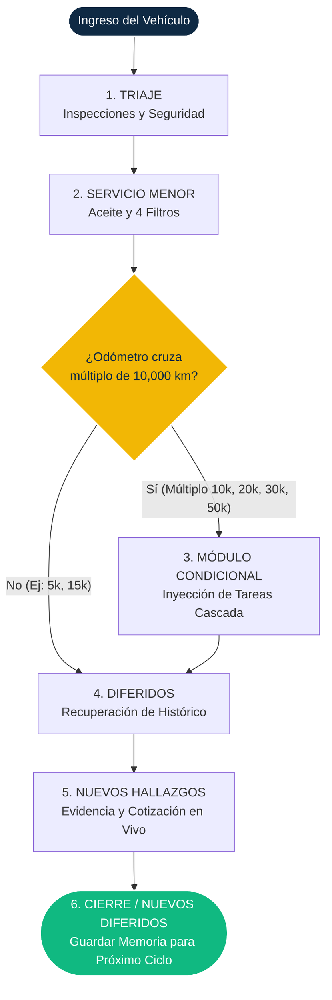

# Arquitectura Operativa: Proceso Universal Archon (PUA)

**Documento Maestro de Especificación Funcional**

> [!NOTE] > **Resumen Ejecutivo para el Product Owner**
> Este documento define el rediseño arquitectónico del Módulo de Mantenimiento de Archon ERP. Al fusionar la rigurosidad operativa requerida por la industria minera (estándar TRX) con los manuales de servicio tradicionales de agencia (Servicios de 10k, 20k, 30k), hemos abstraído un **Proceso Universal inamovible de 6 Etapas**. Este flujo reduce a cero la ambigüedad del técnico, protege la integridad del activo (motor) en condiciones extremas y automatiza las ventas cruzadas (upselling) mediante memoria histórica.

---

## 1. El Flujo de Trabajo Inamovible (Las 6 Etapas)

Sin importar si el vehículo es una van de reparto urbano o una pick-up sometida a la abrasión de una mina, Archon exige que la Orden de Trabajo pase secuencial y obligatoriamente por estas 6 etapas:

1. **Triaje (Inspección Inicial):** Inspecciones visuales, de niveles y de seguridad para todos los vehículos. Protege legalmente al taller y previene fallas críticas.
2. **Servicio Menor:** Mantenimiento de supervivencia. Reemplazo de los 5 consumibles vitales (Aceite + 4 filtros).
3. **Módulo Condicional (Cascada):** El motor lógico de Archon inyecta tareas extra pesadas (rotación, lavado, bujías, frenos) dinámicamente basándose en el odómetro y el plan del vehículo.
4. **Diferidos (Históricos):** El sistema alerta automáticamente si en el mes anterior el cliente pospuso una reparación.
5. **Nuevos Hallazgos (Suplementos):** Se evidencia y avisa de problemas mecánicos encontrados en vivo con la unidad desarmada para buscar autorización y aumentar el ticket.
6. **Definición de Nuevos Diferidos / Cierre:** Si no se autorizó el suplemento del Paso 5, o se diagnosticó un desgaste a futuro en la prueba de ruta, Archon lo guarda en el historial para la próxima visita y se cierra la orden.

### Diagrama del Motor PUA

---

## 2. El Núcleo de la Lógica (Cómo piensa Archon)

Detrás de la interfaz del mecánico, Archon ejecuta un motor matemático basado en 3 "Reglas de Oro":

> [!IMPORTANT] > **Regla 1: Del Triaje (Etapa 1)** > **Condición:** Obligatorio para el 100% de los ingresos.
> **Acción:** Se inyectan de golpe las 9 tareas visuales de inspección. Ningún vehículo se va sin revisión de frenos o seguridad.

> [!CAUTION] > **Regla 2: Del Consumible (Etapa 2)** > **Condición:** Obligatorio para el 100% de los ingresos.
> **Acción:** Se inyectan de golpe las 5 tareas de supervivencia del motor. Todo ingreso recibe: Aceite, Filtro de Aceite, Filtro de Aire, Filtro de Combustible, y Filtro de Cabina (Gasolina) o Separador de Agua (Diésel). Esto blinda a los motores mineros contra la abrasión prematura.

> [!TIP] > **Regla 3: De la Cascada (Etapa 3) y Deduplicación** > **Condición:** Condicional al Kilometraje.
> **Acción:** Archon divide el odómetro entre 10,000. Si hay coincidencia (dentro de la **ventana de tolerancia simétrica de ±1,500 km**), inyecta los paquetes de tareas pesadas (Ej: `20,000 % 10,000 == 0`). Si no es múltiplo, la Etapa 3 se salta silenciosamente.
> **Deduplicación:** Si un vehículo entra por desfase a los 11,400 km (recibe Paquete 10k) y vuelve a los 21,400 km (recibe Paquetes 10k+20k), el sistema **purga automáticamente** las tareas de 10k si ya fueron ejecutadas exitosamente en el ciclo inmediato anterior, evitando el doble cobro.

> [!TIP] > **Regla 4: Especificidad de Marca (Etapa 3) y Hard Stop** > **Condición:** Condicional a la Marca y Combustible del Vehículo.
> **Acción:** Archon añade tareas atómicas específicas dictadas por el fabricante a la cascada de la Etapa 3.
> **Protección EAL6+ (Hard Stop):** Si el expediente del vehículo no tiene Marca, VIN, Combustible o Tipo de Flota (Urbana/Minera) definidos en la base de datos, el sistema **bloquea** la apertura de la orden. No hay fallas silenciosas ni inyecciones genéricas.

> [!IMPORTANT] > **Regla 5: La Válvula de Escape Bifurcada (Lógica del Diferido)** > **Condición:** Si una tarea en pantalla no se ejecuta.
> **Acción:** El sistema obliga al técnico a bifurcar la omisión en dos estados distintos:
>
> - **`DEFERRED_FINANCIAL`:** Rechazo por presupuesto o falta de tiempo del cliente. La tarea reaparece con alerta de urgencia en el siguiente servicio.
> - **`N_A_STRUCTURAL`:** El vehículo no cuenta con el componente (ej. no tiene tambores traseros). La tarea se oculta permanentemente de los servicios futuros para no generar "ruido" al técnico.

> [!CAUTION] > **Regla 6: Atomicidad de Inyección (Transacción ACID)** > **Condición:** Al crear una orden de trabajo.
> **Acción:** Crear una orden implica inyectar hasta ~77 registros de tareas en la BD de golpe. El motor utiliza Transacciones ACID estrictas (Todo o Nada). Si falla el `INSERT` de la tarea 76, el sistema aborta y revierte las 75 anteriores para prevenir órdenes corruptas.

> [!CAUTION] > **Regla 7: Timeout de Resolución (Etapa 5)** > **Condición:** Cuando se espera autorización del cliente por un hallazgo mecánico.
> **Acción:** Existe un timeout operativo (ej. 24h hábiles). Si el cliente no responde en ese lapso, el hallazgo transita automáticamente a `DEFERRED_FINANCIAL` para liberar el flujo de trabajo del taller y permitir el cierre de la orden.

---

## 3. Taxonomía Exhaustiva de Tareas (Desglose Atómico)

Esta es la lista exacta de tareas atómicas que Archon inyectará en la pantalla del mecánico:

### ETAPA 1: TRIAJE (Obligatorio para todos)

- [ ] Revisión de luces de tablero (Testigos encendidos).
- [ ] Revisión de aire acondicionado y calefacción.
- [ ] Revisión de claxon.
- [ ] Revisión de cinturones de seguridad (Bloqueo y anclaje).
- [ ] Revisión de luces interiores de cabina.
- [ ] Revisión de luces principales altas.
- [ ] Revisión de luces principales bajas.
- [ ] Revisión de luces direccionales e intermitentes.
- [ ] Revisión de luces traseras de stop.
- [ ] Revisión de luz de reversa.
- [ ] Revisión de desgaste en plumas limpiaparabrisas.
- [ ] Revisión de estrelladuras en parabrisas y cristales.
- [ ] Revisión de golpes o abolladuras en carrocería general.
- [ ] Revisión de fugas de aceite de motor (Cárter/Tapas).
- [ ] Revisión de fugas de anticongelante (Radiador/Mangueras).
- [ ] Revisión de fugas de dirección hidráulica (Cremallera/Bomba).
- [ ] Revisión de fugas de líquido de frenos (Líneas/Cálipers).
- [ ] Revisión de fugas de combustible (Líneas/Tanque).
- [ ] Revisión de corrosión o roturas en el sistema de escape.
- [ ] Revisión visual de soportes de motor.
- [ ] Revisión visual de soportes de transmisión.
- [ ] Inspección de nivel de anticongelante.
- [ ] Inspección de nivel de líquido de frenos.
- [ ] Inspección de nivel de fluido de dirección.
- [ ] Revisión de limpieza en terminales de batería.
- [ ] Medición con multímetro de voltaje de batería.
- [ ] Revisión de funcionamiento de torreta (Solo Minería).
- [ ] Revisión de estado de pértiga (Solo Minería).
- [ ] Revisión de caducidad y presión de extintor (Solo Minería).
- [ ] Revisión de presencia de calzas (Solo Minería).
- [ ] Revisión de funcionamiento de estrobos (Solo Minería).
- [ ] Revisión de alarma sonora de reversa (Solo Minería).
- [ ] Revisión de estado de cintas reflejantes (Solo Minería).
- [ ] Conexión de Escáner OBD2 y búsqueda de códigos de falla.

### ETAPA 2: SERVICIO MENOR (Obligatorio para todos)

- [ ] Drenado de aceite viejo de motor.
- [ ] Llenado de aceite nuevo de motor al nivel especificado.
- [ ] Remoción de filtro de aceite viejo e instalación de nuevo.
- [ ] Remoción de filtro de aire viejo e instalación de nuevo.
- [ ] Remoción de filtro de combustible viejo e instalación de nuevo.
- [ ] Remoción de filtro de cabina viejo e instalación de nuevo (Solo Gasolina).
- [ ] Remoción de separador de agua viejo e instalación de nuevo (Solo Diésel).

### ETAPA 3: MÓDULO CONDICIONAL (La Cascada Acumulativa)

**A. Paquete Básico (Se inyecta a los: 10k, 20k, 30k, 40k, 50k, 60k)**

- [ ] Medición en milímetros de profundidad de desgaste de llantas.
- [ ] Calibración de presión de aire (Llantas instaladas).
- [ ] Calibración de presión de aire (Llanta de refacción).
- [ ] Rotación de llantas según patrón del fabricante.
- [ ] Lubricación/Engrase de crucetas de la barra cardán.
- [ ] Lubricación/Engrase de rótulas de suspensión.
- [ ] Lavado exterior a presión de carrocería y chasis.
- [ ] Aspirado interior de cabina.
      **[Reglas de Marca 10k]**
- [ ] Revisión de holgura en pedales (Solo Toyota).
- [ ] Revisión de bisagras y cerraduras (Solo Toyota).
- [ ] Medición de rendimiento en ralentí por escáner (Solo Kia).
- [ ] Revisión de guardapolvos de flechas (Solo Mitsubishi).
- [ ] Revisión de mangueras de vacío (Solo Mitsubishi).
- [ ] Revisión visual de vigas principales de chasis (Solo Dodge/RAM).
- [ ] Revisión de muelles de carga de batea (Solo Dodge/RAM).

**B. Paquete Intermedio (Se inyecta acumulado a los: 20k, 30k, 40k, 50k, 60k)**

- [ ] Medición de grosor de pastillas de freno delanteras.
- [ ] Medición de ceja/desgaste en discos de freno.
- [ ] Medición de grosor de balatas traseras (o pastillas traseras).
- [ ] Revisión de tambores traseros.
- [ ] Aplicación de limpiador y lubricación de herrajes/cálipers de freno.
- [ ] Revisión de estado físico (cuarteaduras) en mangueras de radiador.
- [ ] Revisión de estado físico en bandas de accesorios/serpentín.
- [ ] Limpieza a presión de panel exterior del radiador.
      **[Reglas de Marca 20k]**
- [ ] Revisión de sensores de impacto frontal (Solo Nissan).
- [ ] Revisión de anclajes de asientos (Solo Nissan).
- [ ] Ajuste de chicote de acelerador (Solo Toyota).
- [ ] Ajuste de freno de mano de estacionamiento (Solo Toyota).
- [ ] Inspección de mangueras de enfriador CVT (Solo Kia).
- [ ] Revisión de fugas en carcasa CVT (Solo Kia).
- [ ] Revisión de cableado expuesto en chasis (Solo Mitsubishi).
- [ ] Lubricación de cerraduras de carrocería (Solo Mitsubishi).
- [ ] Revisión de pernos en U de suspensión trasera (Solo Dodge/RAM).
- [ ] Inspección de bujes de muelles (Solo Dodge/RAM).

**C. Paquete Mayor (Se inyecta acumulado a los: 30k, 40k, 50k, 60k)**

- [ ] Desmontaje y lavado de inyectores en laboratorio (o Boya).
- [ ] Desmontaje y limpieza de cuerpo de aceleración con solvente.
- [ ] Drenado/Extracción de líquido de frenos viejo del depósito.
- [ ] Llenado con líquido de frenos nuevo.
- [ ] Purga de aire en las 4 ruedas del sistema de frenos.
- [ ] Extracción de bujías viejas (Solo Gasolina).
- [ ] Calibración e instalación de bujías nuevas (Solo Gasolina).
      **[Reglas de Marca 30k]**
- [ ] Prueba de caída de voltaje en alternador (Solo Nissan).
- [ ] Revisión de relevadores principales (Solo Nissan).
- [ ] Revisión de nudos de columna de dirección (Solo Toyota).
- [ ] Inspección de riel de inyectores y conexiones (Solo Toyota).
- [ ] Escaneo de módulo TCM de transmisión (Solo Kia).
- [ ] Medición de temperatura de fluido CVT (Solo Kia).
- [ ] Inspección de bieletas y terminales de dirección (Solo Mitsubishi).
- [ ] Engrase de caja de dirección (Solo Mitsubishi).
- [ ] Revisión de respiradero de diferencial trasero (Solo Dodge/RAM).
- [ ] Inspección de flechas de eje trasero (Solo Dodge/RAM).

**D. Paquete Avanzado (Se inyecta acumulado a los: 50k, 60k)**

- [ ] Drenado total de anticongelante viejo del sistema.
- [ ] Llenado de anticongelante nuevo y purga de burbujas del sistema.
- [ ] Drenado de aceite viejo de transmisión (Manual/Auto/CVT).
- [ ] Remoción de cárter e instalación de filtro de transmisión nuevo (Si es Auto/CVT).
- [ ] Llenado de aceite nuevo de transmisión al nivel especificado.
- [ ] Prueba de compresión manual en amortiguadores (Rebote).
- [ ] Revisión visual de fugas en los 4 amortiguadores.
- [ ] Inspección con barreta de desgaste en bujes y horquillas de suspensión.
- [ ] Drenado de aceite viejo de diferencial trasero (Si es Tracción Trasera/Carga).
- [ ] Llenado de aceite nuevo de diferencial trasero (Si es Tracción Trasera/Carga).
      **[Reglas de Marca 50k]**
- [ ] Revisión de actuador 4x4 (Solo Toyota).
- [ ] Inspección de flechas cardán delanteras (Solo Toyota).
- [ ] Calibración de sensor de ángulo de giro (Solo Kia).
- [ ] Revisión de motor eléctrico de dirección EPS (Solo Kia).
- [ ] Revisión de diferencial delantero nivel y fugas (Solo Mitsubishi).
- [ ] Inspección de placas protectoras de cárter Skid plates (Solo Mitsubishi).
- [ ] Revisión de soldaduras en tirón de arrastre (Solo Dodge/RAM).
- [ ] Revisión de conector eléctrico de remolque 7 pines (Solo Dodge/RAM).

### ETAPAS 4, 5 y 6 (Flujo Lógico de Cierre)

- [ ] **(Etapa 4):** Evaluar tareas históricas en estado `DEFERRED_FINANCIAL` (Rechazos previos). _Nota: las `N_A_STRUCTURAL` no se inyectan para mantener limpio el flujo._
- [ ] **(Etapa 5):** Ingresar descripción y evidencia multimedia de hallazgos mecánicos imprevistos y enviar cotización.
- [ ] **(Etapa 5.1):** Esperar autorización. Si cruza el Timeout (24h hábiles) sin respuesta, el hallazgo se mueve automáticamente a `DEFERRED_FINANCIAL`.
- [ ] **(Etapa 6):** Prueba de ruta en calle (Verificar aceleración, frenado y ruidos).
- [ ] **(Etapa 6):** Cargar evidencia multimedia y expediente forense general del servicio (Prueba de trabajo completado).
- [ ] **(Etapa 6):** Marcar Checklist de Control de Calidad final y cerrar orden.

---

## 4. Casos de Uso en la Vida Real (Ejemplos de Operación)

Para demostrar la robustez del motor de Archon, aquí mostramos cómo se comporta en los 3 escenarios operativos más comunes:

### Ejemplo 1: La Pick-Up Minera en "Vuelta Corta"

- **Contexto:** Toyota Hilux Diésel, asignada a Mina (Intervalo: 5,000 km o 90 días).
- **Odómetro al ingresar:** `5,000 KM`.

**Comportamiento del PUA:**

1. **Etapa 1:** Inspecciona frenos, llantas, fluidos y equipo de seguridad minera (pértiga, torreta).
2. **Etapa 2:** Cambia Aceite y los 4 Filtros (incluyendo el separador de agua).
3. **Etapa 3:** ¡VACÍA! (`5,000 % 10,000` no da cero). Archon sabe que no toca rotar llantas ni hacer servicios mayores.

- **Resultado:** El vehículo es atendido con máxima velocidad, enfocado 100% en supervivencia contra el polvo.

### Ejemplo 2: El Vehículo Urbano en "Vuelta Media"

- **Contexto:** RAM Gasolina, asignada a Ciudad (Intervalo: 10,000 km o 180 días).
- **Odómetro al ingresar:** `20,000 KM`.

**Comportamiento del PUA:**

1. **Etapa 1:** Inspecciona frenos, llantas, batería.
2. **Etapa 2:** Cambia Aceite y los 4 Filtros (incluyendo el de cabina).
3. **Etapa 3:** Archon activa la matemática (`20,000 % 10,000 == 0`). Como es múltiplo par, inyecta la cascada 10k y 20k: **Rotación de llantas, lavado, limpieza de frenos profunda, y revisión de bandas.**

- **Resultado:** El vehículo urbano recibe su mantenimiento profundo exacto en la ventana de tiempo del fabricante.

### Ejemplo 3: La Pick-Up Minera en "Vuelta Larga" (La Prueba de Fuego)

- **Contexto:** La misma Toyota Hilux Diésel de la Mina.
- **Odómetro al ingresar:** `30,000 KM`.

**Comportamiento del PUA:**

1. **Etapa 1:** Todo el triaje visual y de seguridad.
2. **Etapa 2:** Sus 5 reemplazos de supervivencia habituales.
3. **Etapa 3:** Archon detecta la matemática (`30,000 % 10,000 == 0`). Inyecta la artillería pesada automáticamente acumulando hasta el nivel 30k: **Rotación, Lavado, Engrase, Limpieza de frenos, Lavado de Inyectores y Cambio de Líquido de Frenos.**

- **Resultado:** El mecánico no tuvo que pensar, dudar, ni mezclar manuales. Archon colapsó ambos servicios sin redundancia. El taller facturó un ticket de alto margen y garantizó la viabilidad del motor.
