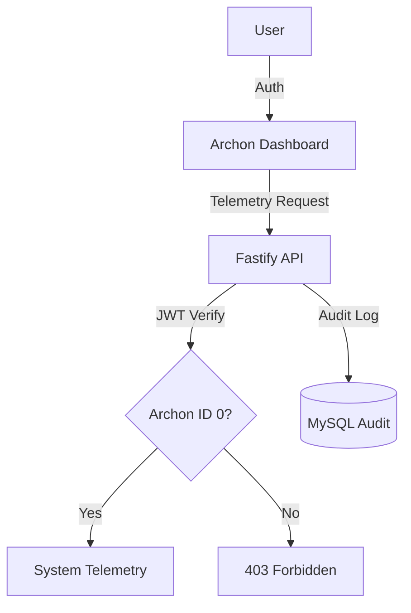

# 🌌 PIIC Maintenance System - Archon Core


## 🎯 Project Vision
A premium, high-security automotive fleet maintenance system engineered for visual immortality and operational excellence. Following the **PINNACLE Identity Manifesto**.

## 🏗️ Architecture (Phase 0: Archon Core)



### Tech Stack
- **Frontend**: React 18, Vite, Tailwind CSS, Framer Motion.
- **Backend**: Fastify, TypeScript, @fastify/jwt.
- **Database**: MySQL (`u701509674_Mant_piic`).
- **QA**: ESLint (Airbnb), Prettier, Husky, Vitest.

## 🚀 Getting Started

### Prerequisites
- Node.js 18+
- MySQL Server

### Local Installation
1. Clone the repository.
2. Run `npm install` in the root.
3. Configure `.env` based on `.env.example`.
4. Start development:
   ```bash
   npm run dev
   ```

## 🛡️ Security Protocol
- **Archon Clearance**: Only users with ID 0 have full system bypass.
- **JWT Rotation**: Secure token management with strict expiration.
- **Audit Logging**: Every failed access attempt is logged with high priority.

## 📐 Design Tokens
- **Primary**: `#0F2A44` (Deep Space Blue)
- **Accent**: `#F2B705` (Teck Yellow)
- **Grid**: 8px Base

---
© 2026 PIIC Identity System. Engineered for professional excellence.
