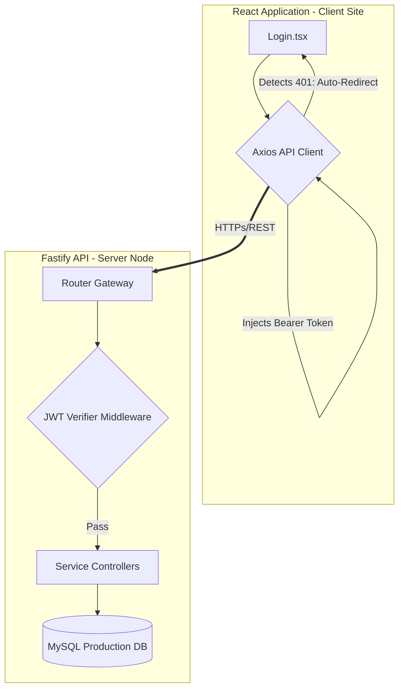
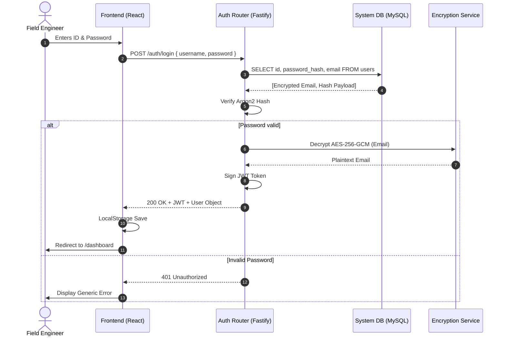
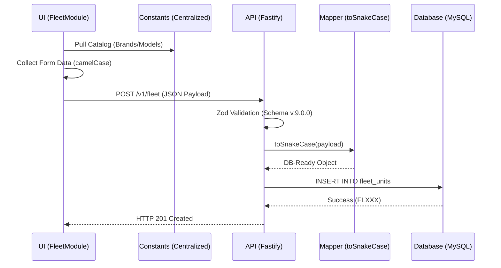
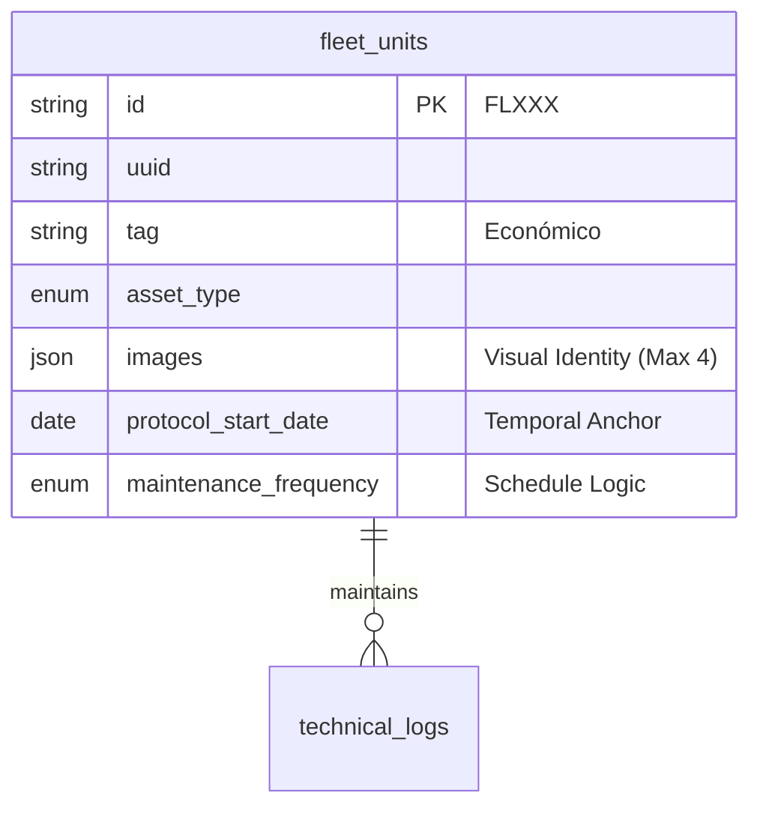

# ARCHON SYSTEM

## Archon System Architecture — Engineering Blueprint (v.10.0.0)

This manifesto serves as the architectural foundation for the **Pinnacle Identity Standard (PIIC)** applied to the Archon Control Systems. Every core decision follows a rigorous, zero-noise, and Silicon Valley-grade methodology.

---

### I. Stack Topologies

The monorepository utilizes bleeding-edge tooling with distinct boundaries for isolation, performance, and security.

- **Frontend (Web):** React 18, Vite, Tailwind CSS, Vitest.
- **Backend (API):** Node.js, Fastify, Argon2, MySQL2, Vitest.
- **Monorepo Managers:** NPM Workspaces.
- **QA Standards:** ESLint (strictest config), Prettier on `pre-commit` via Husky, 100% Core Test Coverage Threshold.

---

### II. High-Level Node/React Connectivity

The interaction between the client presentation layer and the API microservices is strictly handled via an internal Axios Gateway with an automated Bearer token injection.

---

### III. Authentication & Zero-Trust Protocol

The following diagram tracks the payload execution during a standard login request. Archon employs an Application-Level Encryption (ALE) mechanism, meaning sensitive data (like emails) are retrieved encrypted and decrypted purely inside the API layer.

---

### IV. Continuous Integration & Quality Assurance

- **Husky & Lint-Staged:** Blocks commits lacking correct style compliance (Prettier).
- **Vitest Thresholds:** Enforces `lines: 100`, `branches: 100`, `functions: 100`, `statements: 100` on Core Services and UI Logic. If a developer attempts a regression or unchecked fallback, the PR is automatically flagged and blocked.

---

### V. Fleet Asset Lifecycle Orchestration (v.9.0.0)

The following diagram illustrates the flow from asset incorporation to temporal maintenance baseline registry.

### VI. Data Entity Relationships

