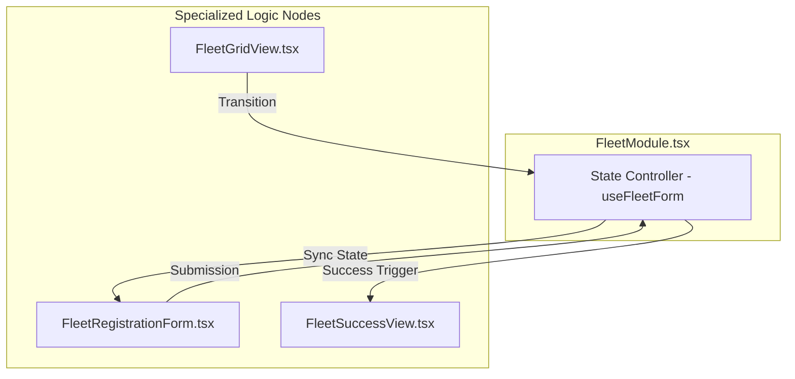
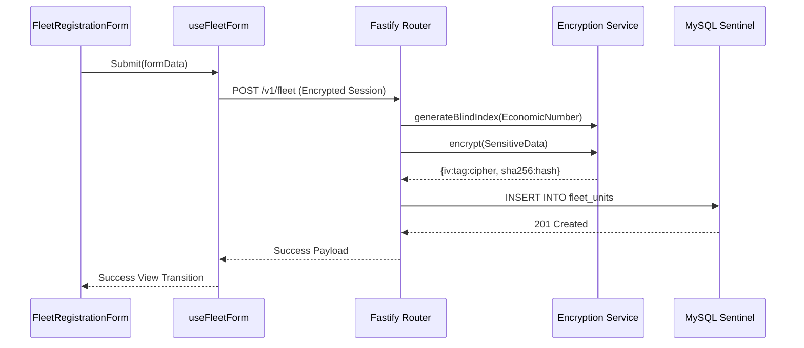
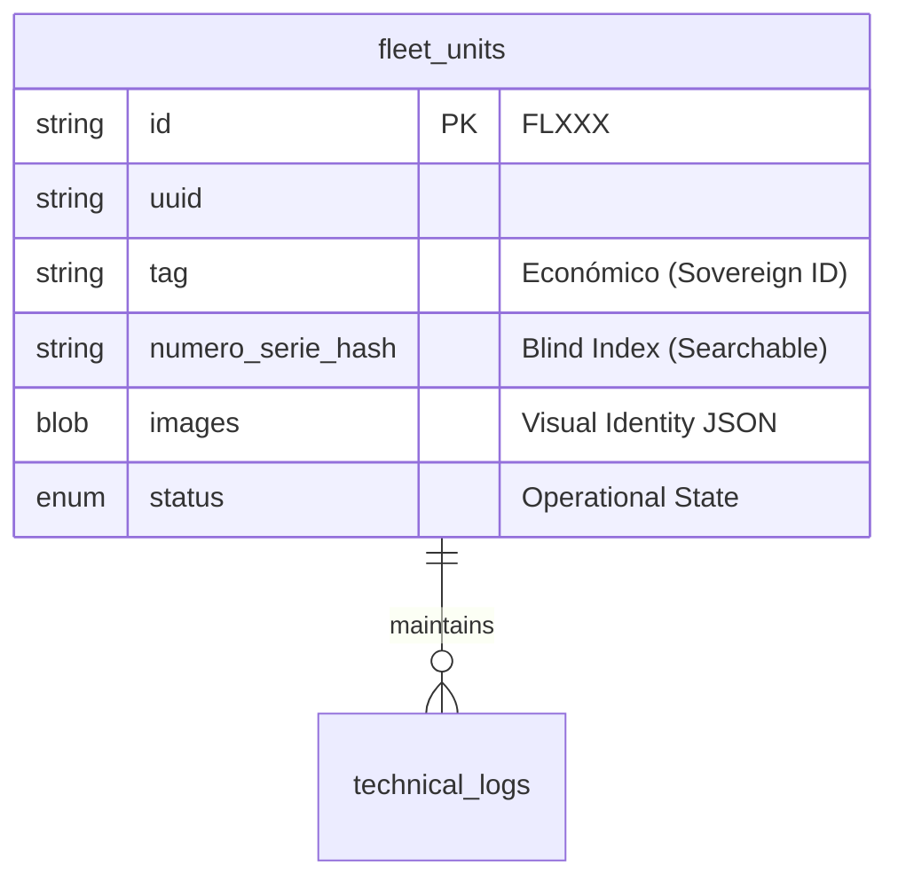

# ARCHON SYSTEM: THE SOVEREIGN STANDARD

## Archon System Architecture — ArchonCore Sovereign v.17.0.0

This manifesto serves as the architectural foundation for the **Pinnacle Identity Standard (PIIC)** applied to the Archon Control Systems. Every core decision follows a rigorous, zero-noise, and Silicon Valley-grade methodology (v.17.0.0).

---

### I. Stack Topologies & Quality Gates

The monorepository utilizes bleeding-edge tooling with distinct boundaries for isolation, performance, and security.

- **Frontend (Web):** React 18 (Modular Atomic Nodes), Vite, Tailwind CSS, Vitest (100% Core Coverage).
- **Backend (API):** Node.js, Fastify, Argon2, MySQL2, Vitest (Contract Verification).
- **Static Analysis:** SonarJS (Cognitive Complexity), Security (Vulnerability Scanners), Unicorn (Hygiene).
- **Automation:** Playwright (E2E Golden Paths), Husky (Git Hooks), Commitlint (Conventional Commits).

---

### II. Modular Atomic Architecture (v.17.0.0)

The Archon Fleet module has been refactored from a monolithic "God Component" into specialized nodes synchronized via a central orchestrator.

---

### III. Identity Fortification Lifecycle

Archon employs an Application-Level Encryption (ALE) mechanism with Searchable Encryption (Blind Indexing).

---

### IV. Continuous Integration Ecosystem

- **Husky & Lint-Staged:** Blocks non-compliant commits.
- **SonarJS:** Enforces cognitive complexity < 20.
- **Vitest Thresholds:** Global 100% threshold for core fleet logic.
- **Playwright Gate:** Validates the Golden Path from Login to Registration.

---

### V. Data Entity Relationships (v.17.0.0)

---
*🔱 Archon System - Pinnacle Identity & Integrity Command*
